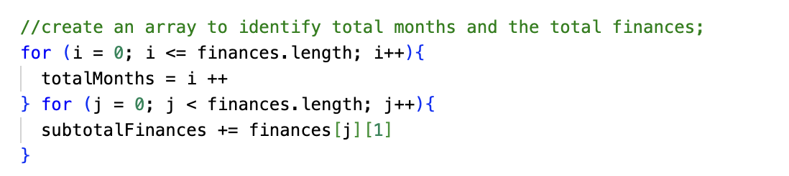
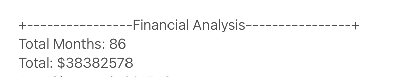
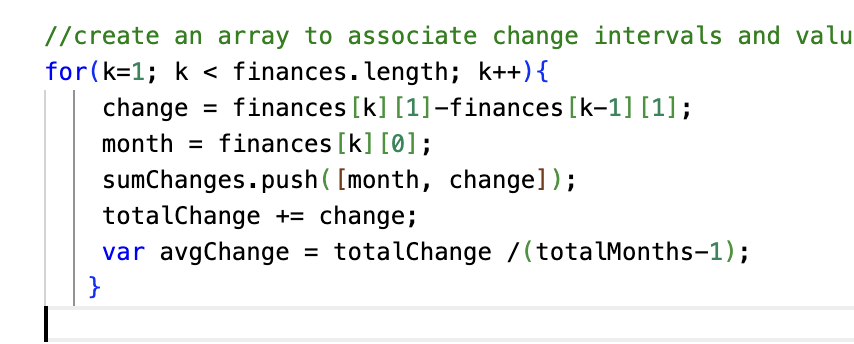
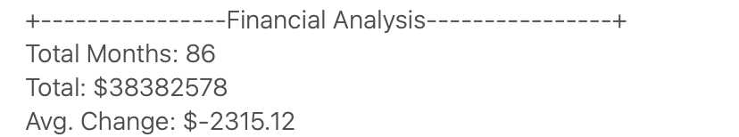
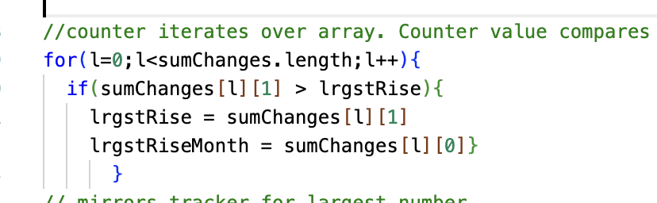
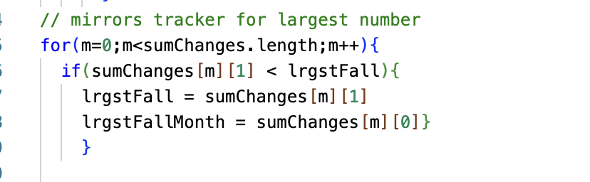
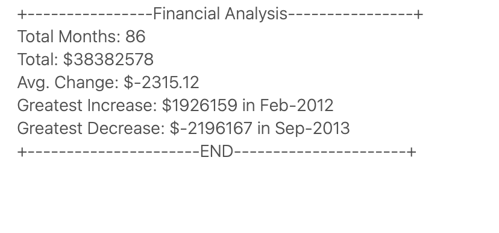
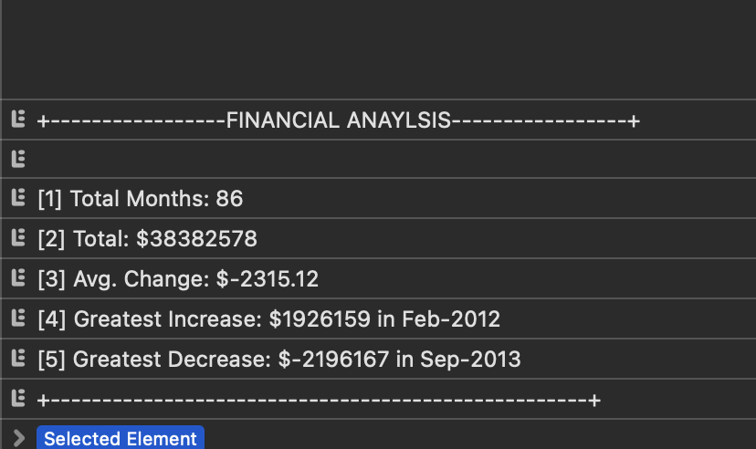

# console-finances
Javascript Financial Console

# Unit 4 Challenge: Console Finances
This project implements several JavaScript algortithms which operate over the array variable "finances" to compute summary statistics for the changes to the financial information contained within the finances dataset. The information is displayed via alerts to a HTML page and are simultaneuosly logged to the "console". 

## Project Brief:
This project had 5 aims.

To calculate the number of months in the dataset "finances".
To calculate the net profit / loss over the period covered by the dataset finances.
To calculate the greatest increase in profit / loss over the period covered by finances.
To calculate the greatest decrease in profit / loss over the period covered by finances.
To display the calculations to an end-user.

I will discuss this project in terms of the algorithms used and in terms of the final outputs.

## Algorithm 1. Calculating Total Months and Net Balance.

The total number of months and the net balance were calculated using the following for loop:

It was quickly identified that the total number of months in the dataset concerned was equal to the number of items in the array finances.

It was thus the case that iteration over the entire array "finances" would provide the figure for the number of months.

A counter (Variable "i") was therefore used which was incremented from a start of 0 up to the length of the dataset finances to provide the figure for the total number of months. The result being 86.

It is important to note that the solving algorithm used in this project would not solve for a count of unique months as no check is made against the elements of the array operated over to check for the reoccurence of some value. As this fell out of scope, it is of no concern for this project, but does highlight a limitation of the algorithm for use in scenarios where a unique count is required. 

A possible solution should a unique count be required could draw upon conversion of the array to a set and the subsequent use of .size to find the number of unique values in the set implementation of "finances".

https://developer.mozilla.org/en-US/docs/Web/JavaScript/Reference/Global_Objects/Set/size

In terms of the calculation of net profit / loss over the period covered by the dataset, each element in the array finances at column index [1] (Which stored the actual financial information) - was added to the variable "subtotalFinances" such that this variable stored the sum value of all of the financial information of the finances array upon iteration over the whole array.

The array was iterated over through a sub loop which used the counter "j".

The result gained for the sum of all figures was $38382578.

## Algorithm 2. Calculation of Average Change and Creation of a New Array Storing Change Values.

The following algorithm calcualtes the average change between values in the array finances and creates an array sumChanges which prepares the data required for identification of the largest increase / decrease:

This loop starts with a counter k set to the value of 1 as the first 'change' is found in the difference between array element 1 and array element 0.

On each iteration, change was calculated as the difference between k - the antecedent of k or "k-1".

 A month value was captured on each iteration such that the value at column index 0 row k was set as the value of the variable month. This enabled a given change between two elements in the array to be associated with a month in which the change in value could be said to have taken place.

A new 2D array called sumChanges was added to on each iteration via the .push method with the value of the month stored in column 0, and the value of the change stored at column 1. 

This array "sumChanges" will be discussed in greater detail in the next section where it is used to provide the figures for the greates increase/decrease. At this point it is simply being instantiated for later use.

"totalChange" is used for the specific purposes of capturing the sum of all of the changes between values. Following the final iteration of the for loop, the value of totalChanges will be equal to the summation of all changes between values in the finances array.

avgChange is then then set to the value of totalChanges / (totalMonths -1). Upon the final iteration, avgChange will be the figure required to show the average of all changes between elements of the array finances.

The result gained from the calculation of average changes was $-2315.12.

N.b. totalMonths was a variable from the previous section which stores the total number of months in the array finances.

N.b. The averag change has been rounded for presentation.

## Algorithms 3a and 3b identifying the largest rise and largest fall in value.

Discussion now returns to the array created in the previous section of this readme "sumChanges".

The previous section made clear that sumChanges stored each change between two values in the array finances, and stored the month in which the change took place.

To identify the greatest rise between two elements in the array finances, it was possible to simply iterate through sumChanges column index [1] with the counter l and compare the value at [l][1] with a zero initialised varaiable "lrgstRise". On each iteration the value of the element at position [l][1] is compared with the 0 initialised "lrgstRise". If the element of the array was greater than "lrgstRise", then "lrgstRise" is set equal to the value at [l][1] and a variable lrgstRiseMonth is set equal to the vaue at [l][0]- if it was smaller, the counter just progressed and no change to lrgstRise occured. On completion of the loop lrgstRiseMonth stored the month in which the largest rise between two elements of the array took place, and lrgstRise the value of the change.

The inverse of this process with a counter m is shown below to calculate/identify the value of the lrgstFall and lrgstFallMonth.

## Results:

The results of the successive algortithms are printed out in an alert when the JS runs.

The results also print to terminal as follows:

